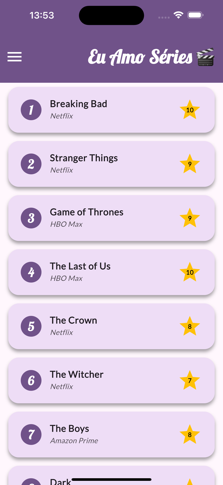
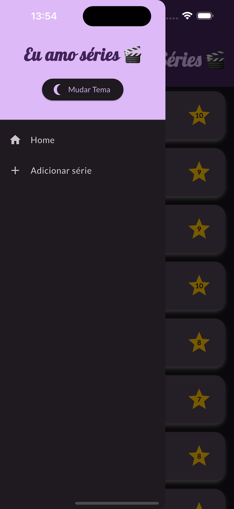
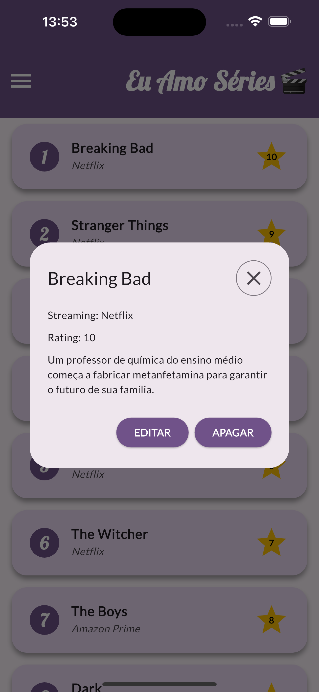
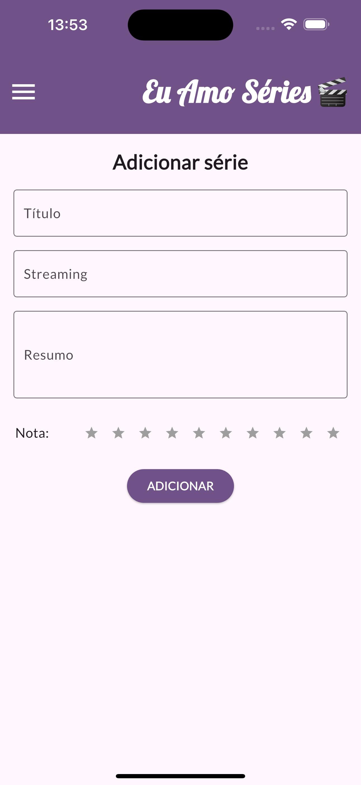
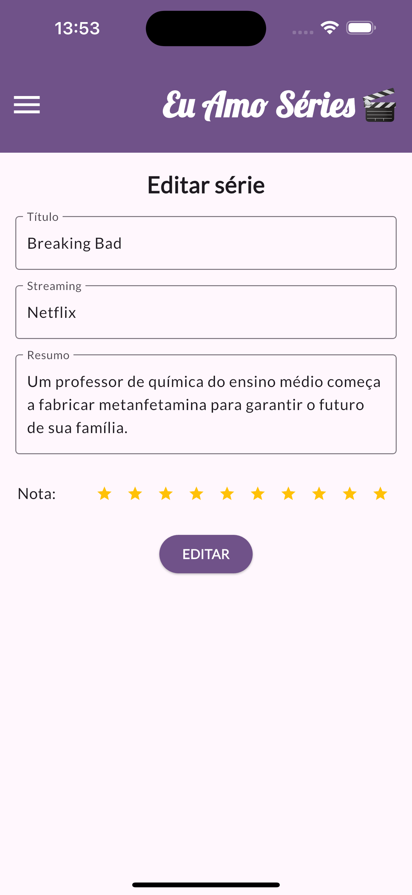

# 🎬 TV Show Manager - App Flutter

Um app Flutter simples e funcional para gerenciar suas séries favoritas com dados mockados. Você pode **adicionar, editar, excluir e avaliar** séries de TV, além de visualizar detalhes como onde assistir e um resumo da trama. O app também conta com alternância de tema entre **modo claro e escuro**, utilizando **GoRouter** para navegação e **Provider** para gerenciamento de estado.

---

## ✨ Funcionalidades

- ✅ Listagem de séries com dados mockados
- ➕ Adicionar novas séries
- ✏️ Editar informações de uma série
- 🗑️ Remover séries da lista
- ⭐ Atribuir uma nota de 0 a 10 para cada série
- 👀 Visualizar detalhes: título, plataforma (stream), nota e resumo
- 🌗 Alternar entre tema claro e escuro
- 📲 Navegação com `GoRouter`
- ⚙️ Estado global com `Provider`

---

## 📱 Captura de Tela







---

## 🧪 Tecnologias utilizadas

- **Flutter**
- **Dart**
- [`GoRouter`](https://pub.dev/packages/go_router)
- [`Provider`](https://pub.dev/packages/provider)
- `ThemeMode` / `ThemeData`

---

## 🚀 Como rodar o projeto

### ✅ Pré-requisitos

- Ter o Flutter instalado
- Ter um emulador Android/iOS ou dispositivo físico conectado
- Git instalado (para clonar o projeto)

### ▶️ Passos

```bash
# 1. Clone o repositório
git clone https://github.com/anaverso/vnt-app2-series.git

# 2. Acesse o diretório do projeto
cd vnt-app2-series

# 3. Instale as dependências
flutter pub get

# 4. Rode o app
flutter run